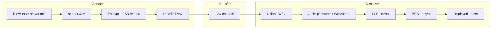

# EchoCrypt

**Secure Voice Communication with Audio Steganography and Fingerprint Authentication**

EchoCrypt is a demonstration web application that lets a **sender** record (or upload) a short voice clip, **encrypt** a secret text message with AES, **embed** the ciphertext in the audio using **least-significant-bit (LSB) steganography**, and **download** a WAV file. A **receiver** then **authenticates** (simulated password and/or **WebAuthn** biometrics on supported devices), **uploads** the encoded WAV, and the server **extracts** the hidden bits and **decrypts** the message.

> **Important:** This project is **educational / proof-of-concept**. It uses a **fixed, shared AES key** derived in code, a **public demo password** (`1234`), and **LSB stego** that is **not** robust against re-encoding, compression, or an adversary with the file. **Do not** use it for real security needs.

---

## Table of contents

- [What the system does (high level)](#what-the-system-does-high-level)
- [Architecture](#architecture)
- [Technology stack](#technology-stack)
- [Repository layout](#repository-layout)
- [Prerequisites](#prerequisites)
- [Installation & local run](#installation--local-run)
- [End-to-end flows](#end-to-end-flows)
  - [Sender flow](#sender-flow)
  - [Receiver flow](#receiver-flow)
- [Cryptography (`crypto.py`)](#cryptography-cryptopy)
- [Steganography (`stego.py`)](#steganography-stegopy)
- [Audio pipeline (`audio_utils.py`)](#audio-pipeline-audio_utilspy)
- [Flask application (`app.py`)](#flask-application-apppy)
- [HTTP API & routes](#http-api--routes)
- [WebAuthn (biometric / passkey) details](#webauthn-biometric--passkey-details)
- [Sessions, storage paths & environment](#sessions-storage-paths--environment)
- [Deployment notes (e.g. Vercel)](#deployment-notes-eg-vercel)
- [Frontend behaviors worth knowing](#frontend-behaviors-worth-knowing)
- [Troubleshooting](#troubleshooting)
- [Development utilities](#development-utilities)
- [Security limitations (read before deploying publicly)](#security-limitations-read-before-deploying-publicly)

---

## What the system does (high level)

| Stage | Where | What happens |
|--------|--------|----------------|
| Voice capture | Sender UI | Record audio as WAV (`sender.wav`), either in the **browser** (MediaRecorder → decode → WAV) or on the **server** (PortAudio / `sounddevice`) when running locally. |
| Encrypt | Server (`crypto.py`) | UTF-8 plaintext → **AES-128 (or 256 depending on key length) in EAX mode** → `nonce \|\| tag \|\| ciphertext` bytes. |
| Embed | Server (`stego.py`) | Ciphertext bytes written into **LSBs** of mono PCM samples, with a **32-bit big-endian length header** first. |
| Save | `uploads/` (or `/tmp` on Vercel) | Result written as `encoded.wav`. |
| Auth | Receiver UI + server | **Password** and/or **WebAuthn** verification before decrypt. |
| Extract + decrypt | Server | LSBs → bytes → AES-EAX decrypt → UTF-8 message shown to the user. |

---

## Architecture

The application is a **monolithic Flask app** with **server-rendered HTML** and **JSON endpoints** for recording, WebAuthn, and browser audio upload. There is **no separate database**; file-based JSON stores WebAuthn credentials, and the **Flask session** stores short-lived WebAuthn challenges and “recently verified” biometric state.



---

## Technology stack

| Layer | Technology |
|--------|------------|
| Web framework | **Flask** 3.x |
| Cryptography | **PyCryptodome** — AES **EAX** (authenticated encryption) |
| Arrays / DSP | **NumPy** |
| WAV I/O | **SciPy** (`scipy.io.wavfile`) |
| Server-side recording | **sounddevice** + **PortAudio** (optional; local dev) |
| Biometrics / passkeys | **webauthn** Python library — registration & authentication ceremonies |
| Frontend | HTML templates, CSS, vanilla JS (`MediaRecorder`, Web Audio API, **WebAuthn** client APIs) |

Dependencies are listed in `requirements.txt`:

`Flask`, `numpy`, `scipy`, `sounddevice`, `pycryptodome`, `webauthn`.

---

## Repository layout

| Path | Role |
|------|------|
| `app.py` | Flask routes, WebAuthn helpers, upload/decrypt pipeline, session wiring |
| `crypto.py` | AES-EAX encrypt/decrypt; fixed key derivation via SHA-256 |
| `stego.py` | LSB embed/extract on mono int PCM |
| `audio_utils.py` | WAV load/save, mono conversion, optional mic recording & device listing |
| `templates/` | `index.html`, `sender.html`, `receiver.html` |
| `static/style.css` | UI styling |
| `uploads/` | Writable directory for WAV outputs (contents gitignored except placeholders — see `.gitignore`) |
| `scripts/test_webauthn_store_lock.py` | Stress test for credential-store locking (optional) |

---

## Prerequisites

- **Python 3** (3.10+ recommended; matches modern Flask/NumPy stacks).
- **Browser with microphone access** for sender “browser” mode (HTTPS or localhost for permissions).
- **PortAudio** / working `sounddevice` only if you use **server-side** recording or server mic test (`Record on Server`, `Test Selected Mic` in server mode). On Windows this often comes with the `sounddevice` wheel; if import fails, install PortAudio per platform docs.

---

## Installation & local run

```bash
cd EchoCrypt
pip install -r requirements.txt
python app.py
```

Then open **`http://127.0.0.1:5000`** (default `host=127.0.0.1`, `port=5000`, `debug=True` in `app.py`).

---

## End-to-end flows

### Sender flow

1. Open **`/sender`** (`sender_page`).
2. **Choose recording mode**
   - **Browser (Vercel-friendly):** Uses `navigator.mediaDevices`, `MediaRecorder`, decodes to PCM, normalizes, builds **WAV**, uploads via `POST /upload_sender_audio`. Works on hosted environments **without** server microphones.
   - **Server microphone (local only):** Uses `POST /record` → `audio_utils.record_audio` → writes **`sender.wav`** on the machine running Flask. Requires `sounddevice`/PortAudio on that machine.
3. **Microphone hygiene (browser mode)**  
   The UI encourages **“Test Selected Mic”** before recording. JS opens the mic with relaxed constraints (`openBrowserMicStream`) for mobile compatibility, analyzes peak/RMS, and surfaces permission/help messages (`describeMicError`).
4. **Optional:** populate server mic list via **`GET /audio_devices`**; test via **`POST /test_mic`** with `mode=server` (sender JS).
5. **Encrypt & embed:** Form **`POST /encrypt_embed`** with field **`message`** (the secret text).
6. Server checks **`sender.wav`** exists, runs **`encrypt_message`** → **`embed_data`** → writes **`encoded.wav`**, flashes success, redirects back to sender.
7. User downloads **`encoded.wav`** from the success section (`GET /download/encoded.wav`).

**Capacity constraint:** Payload size is limited by audio length. Roughly, embedding needs **`32 + 8 × len(secret_bytes)`** sample LSBs (32-bit length header + payload bits). If the message + AES overhead is too large for the clip, embedding raises an error ( surfaced as a flash message).

### Receiver flow

1. Open **`/receiver`** (`receiver_page`).
2. **WebAuthn (optional but typical on mobile)**  
   - **Register:** `POST /webauthn/register/options` → browser creates credential → `POST /webauthn/register/verify`.  
   - **Verify:** `POST /webauthn/auth/options` → assertion → `POST /webauthn/auth/verify`.  
   Success marks the Flask session as **biometrically verified** for a **limited time** (`WEBAUTHN_SESSION_TTL_SECONDS`, default **5 minutes**).
3. **Choose authentication policy**
   - Default: **password OR recent biometric** satisfies decrypt.
   - **“Use biometric only”** (`biometric_only`): **only** recent successful WebAuthn verification counts; password is ignored for authorization (still submitted if present but not used for `authorized`).
4. **Submit** **`POST /upload_decrypt`** with **`audio`** (file), **`password`** (optional depending on mode), **`biometric_only`** checkbox.
5. Server checks authorization, saves upload as **`received_<sanitized_filename>`**, loads WAV → **`extract_data`** → **`decrypt_message`**, renders decrypted **`message`** or an error template.

**Demo password:** `FINGERPRINT_PASSWORD` in `app.py` is **`1234`** (simulated fingerprint).

---

## Cryptography (`crypto.py`)

- **Key derivation:** SHA-256 hash of the fixed UTF-8 string **`echocrypt-demo-shared-secret`** → **32-byte** key used with AES.
- **Mode:** **AES-EAX** (authenticated encryption with associated data capability unused here).
- **Wire format** produced by `encrypt_message`:

  ```
  [ 16 bytes nonce ][ 16 bytes tag ][ N bytes ciphertext ]
  ```

  `decrypt_message` splits nonce/tag/ciphertext, verifies MAC, decodes UTF-8 plaintext.

**Implication:** Anyone with this repository knows the key material derivation; **confidentiality is not robust** against someone who can read the code or binary.

---

## Steganography (`stego.py`)

- **Domain:** **Mono**, **integer PCM** (`numpy` integer array, 1-D).
- **Embedding format (LSB order):**
  1. **Length header:** **32 bits** (big-endian `uint32`) = number of **payload bytes** that follow in the hidden stream.
  2. **Payload:** each byte → 8 bits, **MSB first**, each bit stored in one sample’s **least significant bit**.
- **Functions**
  - `embed_data(audio_samples, secret_bytes)` — returns **new** array with modified LSBs.
  - `extract_data(audio_samples)` — reads length, validates plausibility, reconstructs bytes.

**Fragility:** If the WAV is transcoded, compressed, normalized aggressively, or truncated, **LSBs change** and extraction/decryption **fails**. The pipeline expects a **lossless WAV** round-trip consistent with int16 samples.

---

## Audio pipeline (`audio_utils.py`)

- **Default sample rate:** `44100` Hz (`DEFAULT_SAMPLE_RATE`).
- **`load_audio`:** Reads WAV; **stereo → mono** (mean of channels); float/uint8 → **int16** as needed.
- **`save_audio`:** Writes WAV via SciPy.
- **`record_audio`:** `sounddevice.rec` mono int16; **`_normalize_int16`** boosts quiet signals or **raises** if peak/RMS suggest silence (bad mic / muted).
- **`list_input_devices` / `test_input_device`:** Filter “virtual”/loopback names where possible; deduplicate; short recording for peak/RMS in tests.

---

## Flask application (`app.py`)

**Constants (selected)**

| Symbol | Meaning |
|--------|---------|
| `UPLOADS_DIR` | `./uploads` locally; **`/tmp/echocrypt_uploads`** when env **`VERCEL`** is set |
| `SENDER_WAV` / `ENCODED_WAV` | `sender.wav` / `encoded.wav` |
| `FINGERPRINT_PASSWORD` | `"1234"` |
| `MAX_UPLOAD_BYTES` | 25 MiB |
| `WEBAUTHN_SESSION_TTL_SECONDS` | 300 (5 min) for challenges & “recent biometric” |
| `WEBAUTHN_CREDENTIAL_STORE` / `LOCK` | JSON credential store and cross-process lock file under **`UPLOADS_DIR`** (overrides earlier placeholder paths so serverless has a writable store) |

**WebAuthn credential record shape (JSON):** list of objects with `credential_id` (base64url), `public_key` (base64url), `sign_count`.

**Concurrency:** `_webauthn_store_lock` uses **`threading.RLock`** plus **`msvcrt.locking`** on Windows or **`fcntl.flock`** on Unix on a dedicated lock file so **sign_count** updates stay consistent under parallel requests (`_verify_and_update_sign_count_atomic`).

**Payload parsing:** `_registration_credential_from_payload` / `_authentication_credential_from_payload` build **webauthn** library structs manually for compatibility with environments where `parse_raw`-style helpers differ by version; **`_required_b64url_field`** rejects null/empty WebAuthn JSON fields before base64 decode.

---

## HTTP API & routes

| Method | Path | Purpose |
|--------|------|---------|
| GET | `/` | Landing (`index.html`) |
| GET | `/sender` | Sender UI; exposes download URLs if files exist |
| GET | `/receiver` | Receiver UI; WebAuthn session hints |
| POST | `/record` | Form: `duration`, optional `device_id` — server records `sender.wav` |
| GET | `/audio_devices` | JSON list of server input devices |
| POST | `/test_mic` | Form: `mode=server`, optional `device_id` — server mic signal test |
| POST | `/webauthn/register/options` | JSON registration options + session challenge |
| POST | `/webauthn/register/verify` | JSON attestation verification + persist credential |
| POST | `/webauthn/auth/options` | JSON authentication options + session challenge |
| POST | `/webauthn/auth/verify` | JSON assertion verification + mark session biometric OK |
| POST | `/webauthn/clear` | Clear stored credentials + session biometric flag |
| POST | `/upload_sender_audio` | Multipart `audio` file → validates WAV → `sender.wav` |
| POST | `/encrypt_embed` | Form `message` — needs existing `sender.wav` → `encoded.wav` |
| POST | `/upload_decrypt` | Multipart + password + optional `biometric_only` — decrypt |
| GET | `/download/<filename>` | Serve files from `UPLOADS_DIR` (sanitized name) |

**Error handling:** `413` uploads trigger flash and redirect to receiver (`MAX_CONTENT_LENGTH`).

---

## WebAuthn (biometric / passkey) details

- **Relying party:** `WEBAUTHN_RP_NAME` is **EchoCrypt Receiver**. **`rp_id` / origin** default from **`_effective_webauthn_rp()`**: if `WEBAUTHN_RP_ID` and `WEBAUTHN_RP_ORIGIN` env vars are set, those win; else **`rp_id`** is the request host (with `127.0.0.1` mapped to `localhost`) and **origin** is `request.host_url` without trailing slash.
- **Authenticator policy:** Registration uses **resident keys preferred** and **`user_verification` required** (biometric/PIN on platform authenticators where applicable).
- **Decrypt gate:** `upload_decrypt_route` sets **`authorized`** from password and/or recent biometric verification depending on **`biometric_only`**.

---

## Sessions, storage paths & environment

| Concern | Behavior |
|---------|-----------|
| Flask `secret_key` | Hard-coded demo value in `app.py` — **replace** for any real deployment. |
| Session | Stores WebAuthn challenge (base64url), type, timestamp; **`biometric_verified_at`**. |
| Writable files | WAV outputs and **`webauthn_credentials.json`** live under **`UPLOADS_DIR`**. |
| `.gitignore` | Ignores `uploads/*.wav` and WebAuthn JSON/lock under uploads to avoid committing runtime artifacts. |

**Environment variables**

| Variable | Effect |
|----------|--------|
| `VERCEL` | When set (truthy), `UPLOADS_DIR` is **`/tmp/echocrypt_uploads`** for writable serverless storage. |
| `WEBAUTHN_RP_ID` | Optional explicit WebAuthn RP ID (e.g. your production hostname **without** port). |
| `WEBAUTHN_RP_ORIGIN` | Optional explicit origin (e.g. `https://your-app.vercel.app`). |

---

## Deployment notes (e.g. Vercel)

- **HTTPS:** WebAuthn **requires** a **secure context** (HTTPS) except for `localhost`. Deploy behind HTTPS.
- **Ephemeral filesystem:** Serverless instances may **not** persist `uploads/` between invocations; **`sender.wav` / `encoded.wav` on the server** are only coherent within the same instance/session model the host provides. **Browser recording + upload** (`/upload_sender_audio`) is the intended path for capture on hosted environments.
- **`VERCEL`:** Ensures upload path points at **`/tmp`**, which is writable on Vercel.
- **WebAuthn storage:** Credential JSON must be writable — using **`UPLOADS_DIR`** under `/tmp` avoids read-only project directories.

Exact Vercel configuration (build command, entrypoint) depends on your repo’s deployment recipe; this README documents **application behavior** once the WSGI app runs with **`VERCEL`** set as your platform requires.

---

## Frontend behaviors worth knowing

### Sender (`templates/sender.html`)

- **Browser recording:** Countdown during capture; normalization; WAV encoding in JS; optional **`URL.createObjectURL`** preview before/after upload.
- **getUserMedia:** Uses **`openBrowserMicStream`** fallback chain (ideal device → exact → generic audio) to reduce **NotFoundError** / **OverconstrainedError** on mobile.
- **Mobile hint:** Explains HTTPS + microphone permission + clearing “Block” in site settings.

### Receiver (`templates/receiver.html`)

- **WebAuthn:** Client JS decodes options JSON (handles variants with or without nested `publicKey` for mobile compatibility), calls `navigator.credentials.create` / `get`.
- **File input:** **`accept="*/*"`** so Android’s **Files / Documents** picker appears; server still enforces **`.wav`** extension.

---

## Troubleshooting

| Symptom | Likely cause | What to try |
|---------|----------------|-------------|
| **Permission denied** / mic errors in browser | Mic blocked or not a secure context | Use **HTTPS** or **localhost**; tap **Allow**; reset site permission in browser settings. |
| **Silent recordings** | Gain too low or wrong device | Run **Test Selected Mic**; pick another device; speak clearly; check OS mute. |
| **Server record fails** | No PortAudio / headless server | Use **browser** mode or install PortAudio + working mic on the server host. |
| **WebAuthn fails on Android** | Wrong RP ID/origin, HTTP not HTTPS, or storage read-only | Set **`WEBAUTHN_RP_ID`** / **`WEBAUTHN_RP_ORIGIN`**; deploy HTTPS; ensure credential store path is writable (`VERCEL` + `/tmp`). |
| **Decrypt: extraction / decryption errors** | Wrong file, truncated WAV, or tampered audio | Use **lossless** `encoded.wav` as produced; avoid chat apps that re-encode audio. |
| **Only Voice Recorder / Photos on file picker (legacy)** | Narrow `accept` (older builds) | Current template uses broad **`accept`** + hint text; refresh deployment. |

---

## Development utilities

- **`scripts/test_webauthn_store_lock.py`** — Multithreaded stress test for credential store locking / sign-count updates. Run when modifying WebAuthn persistence logic.

---

## Security limitations (read before deploying publicly)

1. **Hard-coded AES key derivation** — anyone with the code can decrypt captured payloads.
2. **Hard-coded demo password** — trivial to guess; only illustrates a gate.
3. **Flask `secret_key`** — demo value; session fixation / guessing risk if reused seriously.
4. **LSB steganography** — trivially detectable statistically; not censorship-resistant.
5. **No user isolation** — single shared credential list and upload namespace suitable only for demos.
6. **WebAuthn** — Correct for **phishing-resistant login** patterns only when RP ID, origins, and TLS are **properly** configured; this app is simplified.

Use this project to **learn** crypto APIs, WebAuthn ceremony shape, and audio DSP basics — **not** as a secure messenger.

---

## License

No license file is included in this repository snapshot. Add a `LICENSE` file if you distribute or reuse the code.
